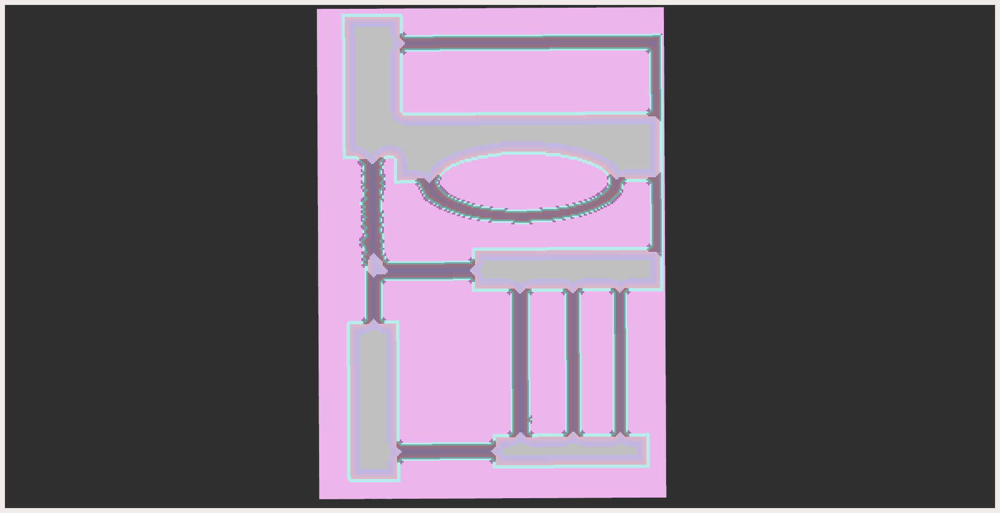

# 感知模块测试程序
### 测试窄道识别
```
colcon build --packages-up-to perception  
ros2 run ros2 run module_test_ros2 narrow_recognition_node __params:=src/navigation/module_test_ros2/perception/params/narrow_recognition.yaml
```
结果:

说明: 图中灰色为识别出的窄道区域。