<!--
 * @FilePath: /src/lidar_slam/README.md
 * @brief: 
 *  
 * 
 * @author: Wei Zhang(zhangwei@cvte.com)
 * @version: v 1.0
 * @Date: 2020-04-21 09:28:13
--> 

## 2022.04.25 : 对代码做了精简，补全了深度点云地图和异常上报功能

## 2021.06.29：以原来的`lidar slam`算法框架为基础，正在进行新版本的改进和优化；

`2021.07.08：苏赟`

1. 增加了IMU互补滤波模块，进行IMU姿态估计；
2. 增加了打印调试变量，用于开启或关闭打印信息；
3. 调整了姿态估计算法的参数，适配当前IMU传感器；
4. 将地图匹配优化后的垂直位姿与IMU垂直位姿进行了互补融合，提高了垂直方向的一致性，z轴漂移减小2m；

`2021.07.01：苏赟`

1. 添加了IMU数据结构及相关变量；
2. 添加了IMU消息订阅，回调函数接口，以及SLAM类接口；
3. 在创建观测帧函数中，根据时间戳提取帧间IMU测量，并利用陀螺仪测量进行预积分得到姿态增量；
4. 利用IMU姿态增量进行点云运动畸变去除，建图效果有明显的提升；
5. 经过测试，只利用IMU旋转进行畸变去除的效果，比IMU加里程计的结果要稍好；可能里程计的位置误差较大；

## cvte_lidar_slam 
`cvte_lidar_slam`是一个多传感器融合的`lidar slam`算法包，本系统以多线激光雷达和里程计，以及可选的`GPS`作为输入，后续可能会加入图像的融合，它能实时输出高精度`6dof`的`pose`,用于机器人导航定位．　

#### **系统框架**     

<p align='center'>
    
</p>  

####  **内容**　
本系统采用了分离设计，即接口和算法分离，`ros_adapter`主要是系统对外`ros`的接口，`slam_core`是核心的算法部分，`params`是参数配置文件；slam算法根据功能划分为几个模块，`common`,`frontend`,`loopend`,`map`,`map_track`,`msf`,`occupancy_map`,`state_machine`,`system`几个子模块。　　

- 　**`common`**   

    通用模块主要是定义基本的数据结构，参数配置接口，数学运算库.

- 　**`frontend`** 

    前端主要包含两个子模块，一个是点云的分割和特征提取.
　

- **`loopend`**

    闭环检测模块对关键帧进行闭环检测，通过几何距离(或者`GPS`，语义识别结果)，在`map`中搜索最近的关键帧，再利用此关键帧临域内的关键帧，构成一个局部地图，进行闭环检测．　　

- **`map`**    

    地图管理模块，里面存放了所有的关键帧数据，提供各种数据调用接口．

- **`map_track`**    

    地图跟踪模块是地图跟踪模块，即`lidarodometry`的解算，同时生成关键帧插入地图模块．　

- **`msf`**    

    多传感器融合模块，进行图优化求解关键帧`pose`．

- **`occupancy_map`**    

    栅格地图模块，用于生成导航所需2d map．

- **`state_machine`**    

    状态机模块，用于slam系统的状态管理.

- **`system`**    

    系统模块是slam对外的封装接口.
　

#### **相关依赖**
- [ROS](http://wiki.ros.org/ROS/Installation) (仅使用`ros`接口，算法不依赖)
- [Eigen](http://eigen.tuxfamily.org/index.php?title=Main_Page)
- [CERES](http://ceres-solver.org/)
- [PCL](https://github.com/PointCloudLibrary/pcl)
- [OpenCV](https://opencv.org/releases/page/2/)

#### **使用方法**
```
ros2 run cvte_lidar_slam lidar_slam_mission_manager __params:=./install/cvte_lidar_slam/params/xxxx.yaml
```

#### **版本发布计划**

- **lidar_slam V3.0**  

#### **开发人员**
曹永，林燕龙，张伟

#### **责任人**
张伟，林燕龙
